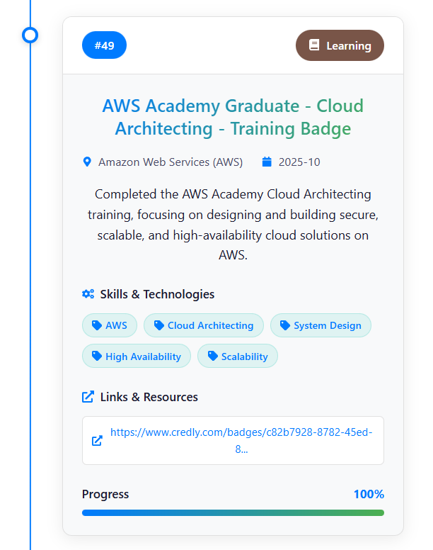
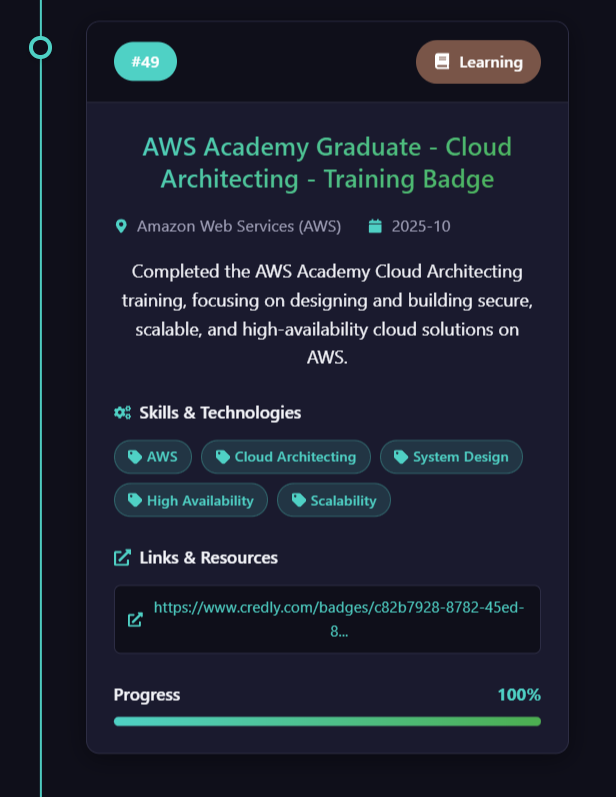

# 🚀 Bonala Shanmukesh - AI/ML Portfolio

> **Deep Learning Enthusiast | Computer Vision Developer | AI Researcher**

[](https://reactjs.org/)
[](https://vitejs.dev/)
[](https://www.framer.com/motion/)
[](LICENSE)

🔗 **Live Demo**: [shanmukeshbonala.vercel.app](https://shanmukeshbonala.vercel.app/)

---

## ✨ Features

- 🌓 **Dark/Light Mode** - Seamless theme switching with system preference detection
- 📱 **Fully Responsive** - Optimized for all devices (mobile, tablet, desktop)
- ⚡ **Fast Performance** - Built with Vite for lightning-fast load times
- 🎨 **Modern UI/UX** - Clean design with smooth animations using Framer Motion
- 📧 **Contact Form** - Functional email integration with EmailJS
- 🔄 **Smooth Navigation** - Page transitions with scroll-to-top functionality
- ♿ **Accessible** - ARIA labels, focus states, and semantic HTML
- 🎭 **Type Animation** - Dynamic role display on homepage

## 📸 Screenshots

| Light Mode | Dark Mode |
|------------|-----------|
|  |  |

## 🛠️ Tech Stack

| Category | Technologies |
|----------|-------------|
| **Frontend** | React 19, React Router 7, Framer Motion |
| **Styling** | CSS3 with CSS Variables, Responsive Design |
| **Build Tool** | Vite 7 |
| **Icons** | React Icons |
| **Email** | EmailJS |
| **Animations** | Framer Motion, React Type Animation |
| **Deployment** | Vercel |

## 📁 Project Structure

```
my-portfolio/
├── public/                 # Static assets (images, JSON data)
├── src/
│   ├── assets/            # Images, resume PDF
│   ├── components/        # Reusable React components
│   │   ├── Navbar.jsx     # Navigation with mobile menu
│   │   ├── Footer.jsx     # Footer with social links
│   │   ├── ProjectCard.jsx # Project display cards
│   │   ├── SkillsGrid.jsx  # Skills display grid
│   │   ├── ActivityTimeline.jsx
│   │   ├── ExperienceTimeline.jsx
│   │   ├── ScrollToTop.jsx # Auto scroll on navigation
│   │   └── BackToTop.jsx   # Floating back-to-top button
│   ├── context/           # React Context (Theme)
│   ├── data/              # JSON data files
│   │   ├── projects.json
│   │   ├── skills.json
│   │   ├── activity.json
│   │   ├── experience.json
│   │   └── certifications.json
│   ├── pages/             # Page components
│   │   ├── HomePage.jsx
│   │   ├── AboutPage.jsx
│   │   ├── ProjectsPage.jsx
│   │   ├── ExperiencePage.jsx
│   │   ├── ActivityPage.jsx
│   │   ├── CertificationsPage.jsx
│   │   ├── ContactPage.jsx
│   │   └── NotFoundPage.jsx  # 404 page
│   ├── App.jsx            # Main app component
│   ├── main.jsx           # Entry point
│   └── index.css          # Global styles & CSS variables
├── scripts/               # Utility scripts
├── templates/             # Update templates
└── package.json
```

## 🚀 Getting Started

### Prerequisites

- **Node.js** v18 or higher
- **npm** or **yarn**

### Installation

```bash
# Clone the repository
git clone https://github.com/Shanmuk4622/my-portfolio.git

# Navigate to the project directory
cd my-portfolio

# Install dependencies
npm install

# Start development server
npm run dev
```

The app will be available at `http://localhost:5173`

### Available Scripts

| Command | Description |
|---------|-------------|
| `npm run dev` | Start development server with HMR |
| `npm run build` | Build for production |
| `npm run preview` | Preview production build locally |
| `npm run lint` | Run ESLint for code quality |

## 🎨 Customization

### Theme Colors

Edit CSS variables in `src/index.css`:

```css
:root {
  --primary-color: #007bff;
  --bg-color: #ffffff;
  --text-primary-color: #1a1a2e;
  /* ... more variables */
}

body.dark {
  --primary-color: #4fd1c5;
  --bg-color: #0f0f1a;
  --text-primary-color: #f5f6fa;
  /* ... more variables */
}
```

### Content Updates

Update your portfolio content by editing JSON files in `src/data/`:

- **projects.json** - Your projects with links, tags, and dates
- **skills.json** - Skills organized by category
- **activity.json** - Activities, achievements, and hackathons
- **certifications.json** - Professional certifications

### Email Setup (Contact Form)

1. Create an account at [EmailJS](https://www.emailjs.com/)
2. Update credentials in `src/pages/ContactPage.jsx`:

```javascript
const serviceID = 'your_service_id';
const templateID = 'your_template_id';
const publicKey = 'your_public_key';
```

## 👨‍💻 About Me

I'm a passionate **B.Tech AI-ML undergraduate** at **VIT-AP University** with a strong focus on:

- 🧠 **Deep Learning** & Neural Networks
- 👁️ **Computer Vision** (YOLO, OpenCV, TensorFlow, PyTorch)
- 🔬 **AI Research** (Anomaly Detection, Semantic Compression)
- 💻 **Full-Stack Development** (React, Node.js, Flutter)

### 🏆 Highlights

- 🥇 Smart India Hackathon Finalist
- 📰 Research paper under review at Springer LNNS
- 🎓 IEEE Student Member & Vice-Chair
- 🚀 9+ AI/ML projects with live demos

## 📞 Connect With Me

<p align="center">
  <a href="https://www.linkedin.com/in/shanmukesh-bonala/">
    
  </a>
  <a href="https://github.com/Shanmuk4622">
    
  </a>
  <a href="https://x.com/Shanmukesh4622">
    
  </a>
  <a href="mailto:shanmueksh.bonala@gmail.com">
    
  </a>
</p>

## 🤝 Open to Opportunities

I'm actively seeking:

- 🔬 AI/ML Research Internships
- 👁️ Computer Vision Engineering Roles
- 💻 Full-Stack Development Positions
- 🤝 Research Collaborations
- 🌐 Open Source Contributions

## 📄 License

This project is open source and available under the [MIT License](LICENSE).

---

<p align="center">
  <b>⭐ Star this repository if you found it helpful! ⭐</b>
</p>

<p align="center">
  Built with using React, Vite, and modern web technologies
</p>
